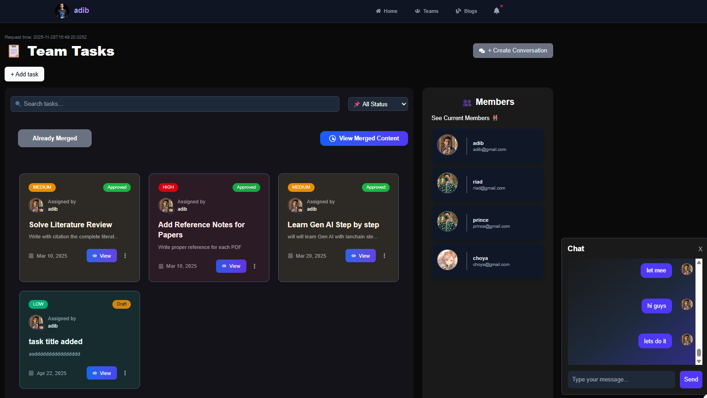
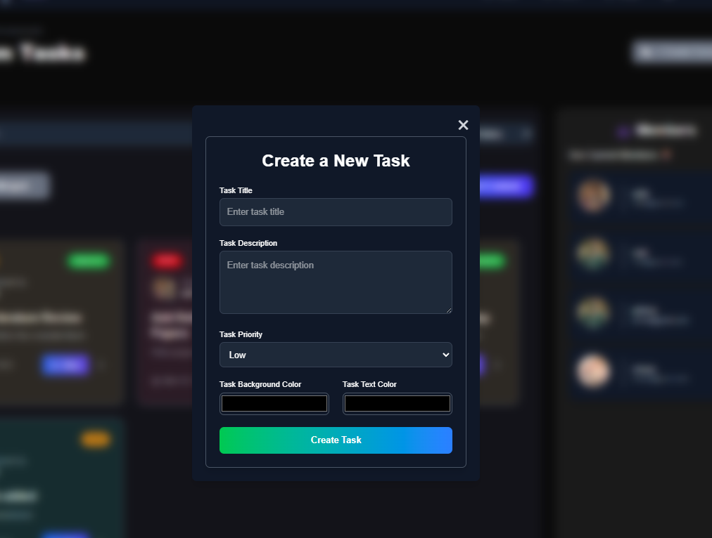
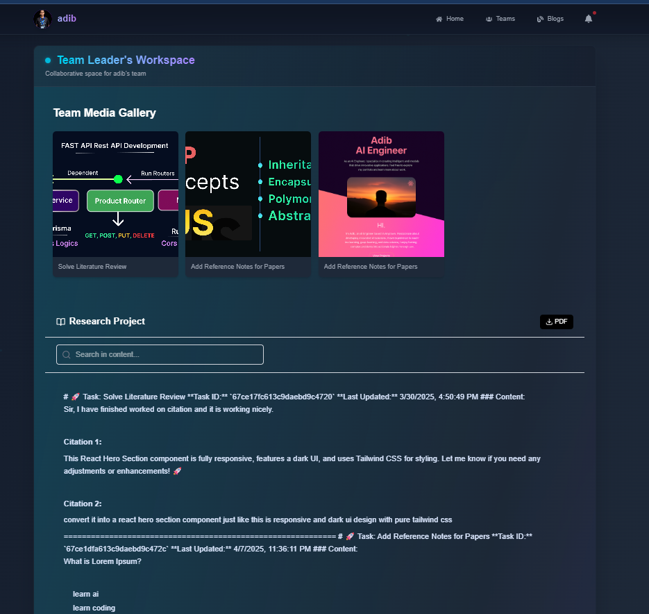
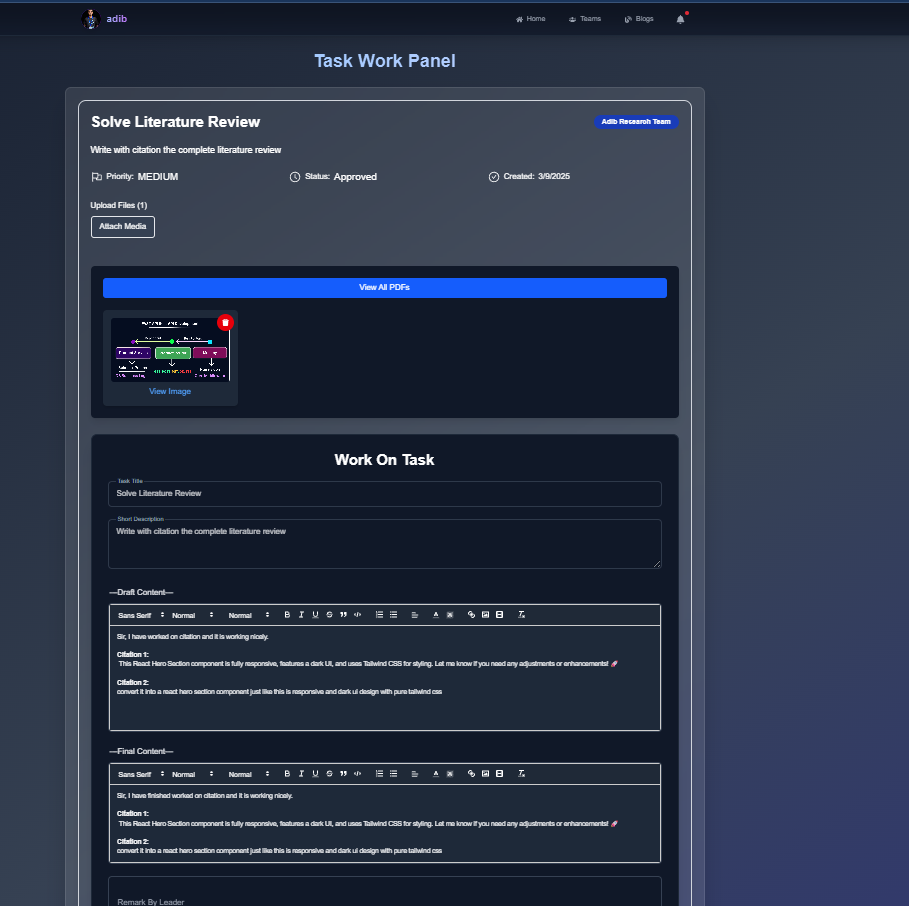

**🚀 Intelligent Research Management System**

A modern, full-stack Next.js powered collaborative platform designed for research teams.
Built with clean architecture, real-time systems, role-based workflows, AI features, and a complete Admin Panel — optimized for scalability and production.

**📸 Screenshots**

Images are served from your /images directory.
Replace the filenames as needed.

👥 Team Panel

### ⭐ Teams Page

**What it shows:**  
A complete overview of my Teams Listing Page

---

📚 Task Workspace

### ⭐ Tasks Page with Search & Filter & Chat

**What it shows:**  
A complete overview tasks listing page with search, filter & realtime Chat System 

---

📚 Task Add Modal

### ⭐ Tasks Add Modal

**What it shows:**  
A complete overview tasks Add System
---

📚 Task Show Merged Page After Approved By Leader with PDF Feature

### ⭐ Tasks Merged Page

**What it shows:**  
A complete overview tasks Merged system with pdf and merged version of all images and content added by member
---

📚 Task Show Merged Page After Approved By Leader with PDF Feature

### ⭐ Tasks Management and assignment for memebers

**What it shows:**  
A complete overview tasks assignment system for memebers
---

📚 Task Work Panel for Members To Add their content with code, ai text and their research content 

### ⭐ Tasks Work Panel For Members 

**What it shows:**  
A complete overview tasks work panel for individual Members
---

✨ Core Features

🔷 Next.js Excellence

⚡ SSR (Server-Side Rendering) for optimized SEO & performance

⚛️ CSR (Client-Side Rendering) for interactive components

📁 Best-practice folder structure (Service Layer + Controller Layer)

**🔐 Middleware-based Role System:**

a. Member

b. Team Leader

c. Admin

👥 Team & Workflow Management
🏗️ Team Creation

Leaders can create teams, manage members, and control permission levels.

**✔️ Task Management System**

1. Members can create tasks and work collaboratively

2. Each task includes a rich text editor for writing research content

3. Members can upload images, documents, and media via Cloudinary

4. Leaders can merge all tasks into a final structured research document

5. Export final merged task as PDF for general users

**🔔 Real-Time System (Pusher.js)**
🚨 Instant Notifications

Powered by Pusher Channels, all events are live!

1. New task creation

2. Member contributions

3. Approval requests

4. Admin approvals

5. Team activity

6. Messages in chat system

7. Leader merges and updates

🔄 Optimistic UI

The UI updates instantly even before server confirmation for smoother UX.

**🛡️ Role-Based Workflow**
👤 Member

1. Work on tasks

2. Upload media files

3. Chat with the team

4. Send approval requests

**🧑‍💼 Leader **

1. Approve or deny task changes

2. Merge tasks

3. Manage team structure

4. Send real-time notifications

5. Generate final research PDF

**👨‍✈️ Admin**

**Manage all teams**

⚙️ Features (Step-by-step)
1. Team & Role Management

Create teams and invite members.

Roles: Member, Leader, Admin.

Middleware enforces role-based access to routes and UI.

2. Task Lifecycle

Members create and edit tasks with a rich-text editor.

Attach media (images, docs, video) via Cloudinary.

Submit tasks for leader approval.

Leaders merge tasks into a single final research document.

3. Approvals & Admin Controls

Leaders send approval requests to Admin.

Admins can view progress, approve final submissions, and manage system-wide roles.

4. Real-Time Collaboration

Pusher.js drives: live notifications, real-time chat, approval events, and typing indicators.

Optimistic UI for instant feedback.

5. AI Assistance

LangChain + LLMs used for:

Research assistance and context-aware suggestions

Text generation for drafts

Summarization and analysis of merged research

6. Export & Delivery

Leaders can merge contributions and export final result to PDF for distribution.

📦 Tech Stack

1. Frontend / Fullstack

2. Next.js (App Router)

3. Tailwind CSS (optional)

5. SSR + CSR mix for best UX

**Backend Architecture**

1. Next.js API Routes

2. Service Layer, Controller Layer

3. Middleware-based authentication & authorization

**Infrastructure**

1. Pusher.js (real-time)

2. Cloudinary (uploads)

3. PDF generation service (server-side)

4. Prisma / MongoDB (data layer)

5. AI

6. LangChain

**Project Live** 🌐 https://intelligent-research-management-app.vercel.app/

**🛠️ Getting Started**
npm install
npm run dev

Visit:
http://localhost:3000

📁 Project Structure Example
src/
│── app/
│   ├── (admin)/
│   ├── (dashboard)/
│   ├── api/
│   │   ├── controllers/
│   │   ├── services/
│   │   └── route.js
│   ├── middleware.js
│── components/
│── lib/
│── hooks/
public/
│── images/

🚀 Deployment

Deploy seamlessly using:

🔗 Vercel Platform
Fully optimized for Next.js applications.

🏆 Why This Project Is Special

This system is not a simple dashboard — it is a complete ecosystem for research teams, integrating:

✔ Real-time collaboration
✔ AI-powered assistance
✔ Production-ready architecture
✔ Admin + Leader + Member workflow
✔ Secure middleware
✔ Cloud uploads
✔ PDF publishing
✔ Notifications
✔ Chat system
✔ Modular backend

✅ Add badges (stars, license, tech stack, build passing)
✅ Add a GIF overview demo
✅ Generate a logo for the project
✅ Write installation docs and API documentation

