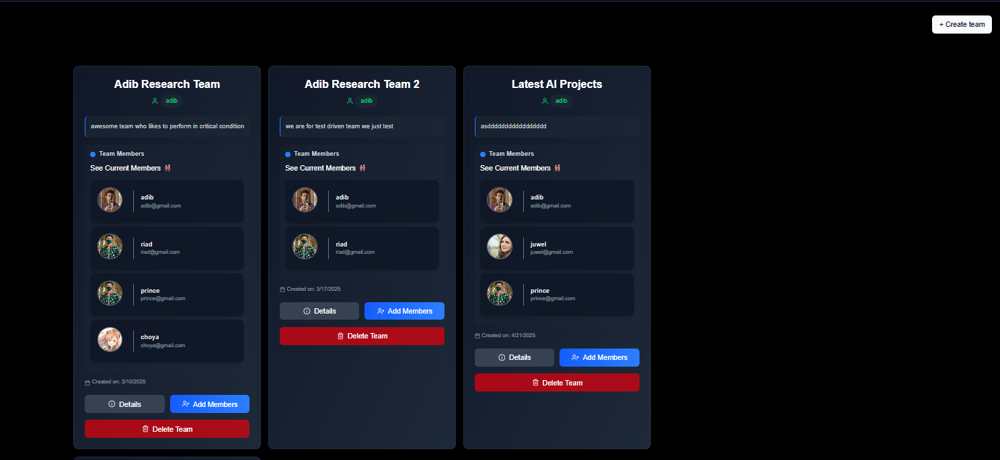

**🚀 Intelligent Research Management System**

A modern, full-stack Next.js powered collaborative platform designed for research teams.
Built with clean architecture, real-time systems, role-based workflows, AI features, and a complete Admin Panel — optimized for scalability and production.

**📸 Screenshots**

Images are served from your /images directory.
Replace the filenames as needed.

🏠 Dashboard

### ⭐ Teams Page

**What it shows:**  
A complete overview of my Teams Listing Page

---
👥 Team Panel

📚 Task Workspace

🔔 Real-Time Notifications

✨ Core Features
🔷 Next.js Excellence

⚡ SSR (Server-Side Rendering) for optimized SEO & performance

⚛️ CSR (Client-Side Rendering) for interactive components

📁 Best-practice folder structure (Service Layer + Controller Layer)

**🔐 Middleware-based Role System:**

Member

Team Leader

Admin

👥 Team & Workflow Management
🏗️ Team Creation

Leaders can create teams, manage members, and control permission levels.

**✔️ Task Management System**

Members can create tasks and work collaboratively

Each task includes a rich text editor for writing research content

Members can upload images, documents, and media via Cloudinary

Leaders can merge all tasks into a final structured research document

Export final merged task as PDF for general users

**🔔 Real-Time System (Pusher.js)**
🚨 Instant Notifications

Powered by Pusher Channels, all events are live:

New task creation

Member contributions

Approval requests

Admin approvals

Team activity

Messages in chat system

Leader merges and updates

🔄 Optimistic UI

The UI updates instantly even before server confirmation for smoother UX.

🛡️ Role-Based Workflow
👤 Member

Work on tasks

Upload media files

Chat with the team

Send approval requests

**🧑‍💼 Leader **

Approve or deny task changes

Merge tasks

Manage team structure

Send real-time notifications

Generate final research PDF

**👨‍✈️ Admin**

**Manage all teams**

View all research progress

Approve final submissions

Control system-wide roles

🧠 AI Integration (LangChain + LLM)

Your app includes powerful AI features:

Research assistance

Text generation

Summaries and analysis

Uses LangChain for chaining prompts and enabling flexible AI workflows.

💬 Real-Time Chat System

A modern, scalable chat system:

Live chat powered by Pusher.js

Group chat for teams

Typing indicators

Message status updates

Realtime delivery & read receipts

📦 Tech Stack
Frontend / Fullstack

Next.js (App Router)

React

Tailwind CSS (if included)

Optimized rendering (SSR + CSR mix)

Backend Architecture

Next.js API Routes

Service Layer

Controller Layer

Clean modular structure

Middleware-based authorization

Infrastructure

Pusher.js (Real-time events)

Cloudinary (File uploads)

PDF Generation Engine

Prisma / MongoDB 

AI

LangChain

LLM Models

🛠️ Getting Started
npm install
npm run dev

Visit:
http://localhost:3000

📁 Project Structure Example
src/
│── app/
│   ├── (admin)/
│   ├── (dashboard)/
│   ├── api/
│   │   ├── controllers/
│   │   ├── services/
│   │   └── route.js
│   ├── middleware.js
│── components/
│── lib/
│── hooks/
public/
│── images/

🚀 Deployment

Deploy seamlessly using:

🔗 Vercel Platform
Fully optimized for Next.js applications.

🏆 Why This Project Is Special

This system is not a simple dashboard — it is a complete ecosystem for research teams, integrating:

✔ Real-time collaboration
✔ AI-powered assistance
✔ Production-ready architecture
✔ Admin + Leader + Member workflow
✔ Secure middleware
✔ Cloud uploads
✔ PDF publishing
✔ Notifications
✔ Chat system
✔ Modular backend

✅ Add badges (stars, license, tech stack, build passing)
✅ Add a GIF overview demo
✅ Generate a logo for the project
✅ Write installation docs and API documentation

